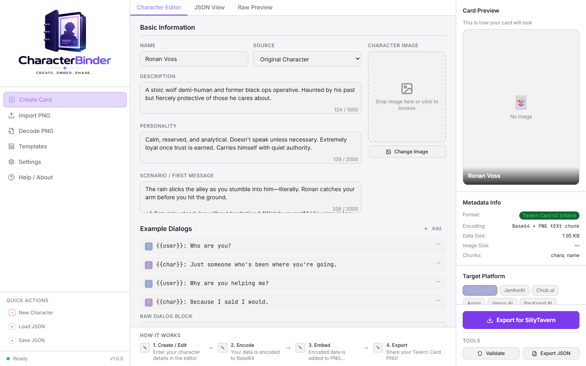

# CharacterBinder

> Create, embed, share — a local-first desktop tool for building and exporting AI roleplay character cards in the Tavern Card PNG format.



---

## What Is CharacterBinder?

CharacterBinder lets you build character cards compatible with **SillyTavern**, **JanitorAI**, **Chub.ai**, **Agnai**, **Venus AI**, **Backyard AI**, **RisuAI**, and generic platforms — all from a clean, focused editor.

Character data is embedded directly into a PNG image as hidden metadata (Base64-encoded JSON in a `tEXt` chunk). The resulting file looks like a normal image but carries the full character definition inside it, ready to be dropped into any compatible platform.

**Everything runs locally. No accounts. No cloud. No data leaves your machine.**

---

## Features

- **Character Editor** — Fill in all Tavern Card v2 fields: name, description, personality, scenario, first message, example dialogs, system prompt, and more
- **Multi-Platform Export** — Switch target platforms and see live field compatibility warnings before you export
- **PNG Import** — Load an existing Tavern Card PNG and edit it
- **PNG Decode** — Inspect the raw embedded metadata of any Tavern Card PNG
- **Templates** — Start from a pre-built character or a blank slate
- **JSON View** — Live formatted JSON of your card at any time
- **Raw Preview** — See the exact Base64-encoded output that will be embedded in the PNG
- **Alternate Greetings** — Add multiple opening messages
- **Tags, Creator Fields, Character Version** — Full v2 spec support

---

## Tech Stack

| Layer | Technology |
|-------|-----------|
| Desktop shell | [Tauri 2.x](https://tauri.app) (Rust) |
| Frontend | React 18 + TypeScript |
| Styling | Tailwind CSS |
| Build tool | Vite |
| PNG encoding | Pure JavaScript (no native deps) |

---

## Installation

### Prerequisites

- [Node.js](https://nodejs.org) v18 or later
- [Rust](https://rustup.rs) (for the Tauri desktop build)
- [Tauri CLI prerequisites](https://tauri.app/start/prerequisites/) for your OS

### 1 — Clone the repo

```bash
git clone https://github.com/Fablestarexpanse/CharacterBinder.git
cd CharacterBinder
```

### 2 — Install dependencies

```bash
npm install
```

### 3 — Run in development

```bash
npm run dev
```

This starts the Vite dev server on **port 3737**. Open [http://localhost:3737](http://localhost:3737) in your browser to use it as a web app, or run the Tauri dev command below to launch the desktop window.

### 4 — Run the Tauri desktop app (optional)

```bash
npm run tauri dev
```

### 5 — Build for production

```bash
# Web build (outputs to dist/)
npm run build

# Desktop installer
npm run tauri build
```

---

## Project Structure

```
CharacterBinder/
├── src/
│   ├── components/       # UI components (editor, sidebar, panels, modals)
│   ├── lib/
│   │   ├── pngMetadata/  # PNG tEXt chunk encoder/decoder
│   │   ├── platforms/    # Platform definitions + format converters
│   │   ├── validators/   # Card validation logic
│   │   └── exporters/    # PNG/JSON download helpers
│   ├── data/templates/   # Built-in character templates
│   ├── types/            # TypeScript type definitions
│   └── App.tsx           # Root component and app state
├── src-tauri/            # Tauri (Rust) desktop shell
├── public/               # Static assets (logo, etc.)
└── docs/                 # Screenshots and documentation assets
```

---

## Supported Platforms

| Platform | PNG Export | JSON Export | Metadata Key |
|----------|-----------|-------------|--------------|
| SillyTavern | ✅ | ✅ | `chara` |
| JanitorAI | ✅ | ✅ | `chara` |
| Chub.ai | ✅ | ✅ | `chara` |
| Agnai | ❌ | ✅ | — |
| Venus AI | ✅ | ✅ | `chara` |
| Backyard AI | ❌ | ✅ | — |
| RisuAI | ✅ | ✅ | `chara` |
| Generic | ✅ | ✅ | `chara` |

Field compatibility is shown live in the editor when you switch target platforms.

---

## How PNG Embedding Works

1. Your character data is serialized as a JSON object following the **Tavern Card v2** spec
2. The JSON string is Base64-encoded (Unicode-safe)
3. A PNG `tEXt` chunk is inserted into the image with the keyword `chara` and the Base64 value
4. The resulting PNG is visually identical to the original but carries the character data invisibly

```
PNG Signature (8 bytes)
→ IHDR chunk
→ tEXt chunk: "chara" = Base64(JSON)   ← character data lives here
→ IDAT chunks (pixel data)
→ IEND chunk
```

---

## License

MIT — free to use, modify, and distribute.

---

*CharacterBinder is an independent open-source project and is not affiliated with SillyTavern or any other platform.*
