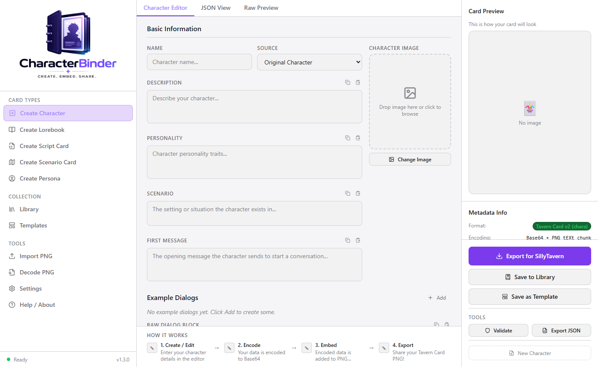

# CharacterBinder

> Create, embed, share — a local-first desktop tool for building and exporting AI roleplay character cards in the Tavern Card PNG format.



---

## Quick Start

### Prerequisites

- [Node.js](https://nodejs.org) v18 or later
- [Rust](https://rustup.rs) — only needed for the Tauri desktop build

### Install & Run

```bash
git clone https://github.com/Fablestarexpanse/CharacterBinder.git
cd CharacterBinder
npm install
npm run dev
```

Opens at **[http://localhost:3737](http://localhost:3737)** in your browser. No Rust required for the web version.

### Desktop App (Tauri)

```bash
npm run tauri dev
```

### Production Build

```bash
# Web — outputs to dist/
npm run build

# Desktop installer
npm run tauri build
```

---

## What Is CharacterBinder?

CharacterBinder lets you build character cards compatible with **SillyTavern**, **JanitorAI**, **Chub.ai**, **Agnai**, **Venus AI**, **Backyard AI**, **RisuAI**, and generic platforms — all from a clean, focused editor.

Character data is embedded directly into a PNG image as hidden metadata (Base64-encoded JSON in a `tEXt` chunk). The resulting file looks like a normal image but carries the full character definition inside it, ready to be dropped into any compatible platform.

**Everything runs locally. No accounts. No cloud. No data leaves your machine.**

---

## Features

### Character Editor
- Fill in all Tavern Card v2 fields: name, description, personality, scenario, first message, example dialogs, system prompt, post-history instructions, and more
- Live character image preview with drag-and-drop support
- Alternate greetings — add multiple opening messages
- Tags, creator fields, character version, and creator notes
- Copy / Paste buttons on every text field with cursor-aware insertion
- JSON View and Raw Preview tabs for direct inspection
- Live token counter (cl100k / GPT-4 standard) with per-field breakdown

### Lorebook Editor
- Build SillyTavern-compatible world info / knowledge books
- Add and manage entries with keyword triggers (primary + secondary), priority, insertion order, and position
- Per-entry toggles: enabled, constant, selective, case-sensitive
- Import existing SillyTavern lorebook JSON via drag-and-drop or file picker
- Creator, version, and creator notes fields
- Export as SillyTavern-compatible JSON or embed in a PNG (`lorebook` chunk)

### Script Card Editor
- Package JavaScript snippets or system prompts as portable, shareable cards
- Full-height code editor with line numbers, syntax highlighting colours, and Tab key support
- Author, version, creator notes, and tags
- Export as JSON or embed in a PNG (`script` chunk)

### Scenario Card Editor
- Create a standalone situation or setting card that can be dropped into any conversation
- Fields: scenario text, opening message, creator, version, creator notes, and tags
- Optional scene image with drag-and-drop support
- Export as JSON or embed in a PNG (`scenario` chunk)

### Persona Card Editor *(v1.4)*
- Define a user persona — who *you* are in the conversation, used as the `{{user}}` identity
- Fields: name, description, personality, appearance, background, creator, version, creator notes, and tags
- Avatar image with drag-and-drop support
- Export as JSON or embed in a PNG (`persona` chunk)

### Card Library
- Save all card types locally in your browser's IndexedDB — no files to manage
- Browse your collection in a thumbnail grid organised by type (Characters, Lorebooks, Scripts, Scenarios, Personas)
- **Version badges** — each card tile shows its version number
- **Clickable tags** — click any tag on a card to instantly filter the library by that tag
- Search by name, type, or tag with a one-click clear button
- Sort by last modified, created date, or name
- Multi-select for bulk delete or export

### Version Control in Library *(v1.4)*
- Changing a card's version number and pressing **Save to Library** creates a **new entry** instead of overwriting the existing one
- Previous versions stay in your library side-by-side
- Works across all card types

### Archive & Export
- **Export ZIP** — download selected cards (or your entire library) as a single `.zip` file
- Each card exports as a `.png` (with embedded metadata) or `.json` (if no image)
- A `manifest.json` is included listing all cards, types, and timestamps
- Perfect for backing up your collection or moving it to another machine

### Multi-Platform Export (Character Cards)
- Switch target platforms and see live field compatibility warnings before you export
- Automatic field mapping and renaming per platform
- PNG export or JSON export depending on platform support
- Save as Template directly from the export panel

### Tools
- **Import PNG** — load any card PNG (character, lorebook, script, scenario, or persona) and open it in the correct editor automatically
- **Decode PNG** — inspect the raw embedded metadata of any card PNG, with full chunk listing and decoded JSON
- **Templates** — start from a built-in character or a blank slate
- **Validate** — check your character card against the Tavern Card v2 spec before exporting

---

## Supported Platforms

| Platform | PNG Export | JSON Export | Metadata Key |
|----------|-----------|-------------|--------------|
| SillyTavern | ✅ | ✅ | `chara` |
| JanitorAI | ✅ | ✅ | `chara` |
| Chub.ai | ✅ | ✅ | `chara` |
| Agnai | ❌ | ✅ | — |
| Venus AI | ✅ | ✅ | `chara` |
| Backyard AI | ❌ | ✅ | — |
| RisuAI | ✅ | ✅ | `chara` |
| Generic | ✅ | ✅ | `chara` |

Field compatibility is shown live in the editor when you switch target platforms.

---

## PNG Metadata Keys

Each card type uses a dedicated `tEXt` chunk keyword so apps can identify the content:

| Card Type | Metadata Key |
|-----------|-------------|
| Character Card | `chara` |
| Lorebook | `lorebook` |
| Script Card | `script` |
| Scenario Card | `scenario` |
| Persona | `persona` |

---

## How PNG Embedding Works

1. Your card data is serialized as a JSON object
2. The JSON string is Base64-encoded (Unicode-safe)
3. A PNG `tEXt` chunk is inserted into the image with the appropriate keyword
4. The resulting PNG is visually identical to the original but carries the full card data invisibly

```
PNG Signature (8 bytes)
→ IHDR chunk
→ tEXt chunk: "chara" = Base64(JSON)   ← card data lives here
→ IDAT chunks (pixel data)
→ IEND chunk
```

---

## Tech Stack

| Layer | Technology |
|-------|-----------|
| Desktop shell | [Tauri 2.x](https://tauri.app) (Rust) |
| Frontend | React 18 + TypeScript |
| Styling | Tailwind CSS |
| Build tool | Vite |
| Local storage | IndexedDB via [idb](https://github.com/jakearchibald/idb) |
| ZIP export | [JSZip](https://stuk.github.io/jszip/) |
| PNG encoding | Pure JavaScript (no native deps) |
| Token counting | [gpt-tokenizer](https://github.com/niieani/gpt-tokenizer) (cl100k) |

---

## Project Structure

```
CharacterBinder/
├── src/
│   ├── components/       # UI components (editors, sidebar, library, modals)
│   ├── lib/
│   │   ├── pngMetadata/  # PNG tEXt chunk encoder/decoder
│   │   ├── platforms/    # Platform definitions + format converters
│   │   ├── validators/   # Card validation logic
│   │   ├── exporters/    # PNG/JSON download helpers
│   │   ├── library/      # IndexedDB card storage (idb)
│   │   ├── archive/      # ZIP export (jszip)
│   │   ├── tokenizer/    # Token counting (cl100k)
│   │   └── customTemplates/ # User-saved templates (localStorage)
│   ├── data/templates/   # Built-in character templates
│   ├── types/            # TypeScript type definitions
│   └── App.tsx           # Root component and app state
├── src-tauri/            # Tauri (Rust) desktop shell
├── public/               # Static assets (logo, etc.)
└── docs/                 # Screenshots and documentation assets
```

---

## Changelog

### v1.4.0
- Added **Persona Card Editor** — define a user persona (`{{user}}` identity) with name, description, personality, appearance, background, avatar image, and PNG/JSON export
- All card types now include **Creator / Author**, **Version**, and **Creator Notes** fields
- **Version-as-new-record** — changing a card's version and saving to library creates a new entry instead of overwriting, preserving all previous versions
- **Library version badges** — each card tile now shows its version number
- **Clickable tag search** — click any tag on a library card to filter by it instantly
- **Auto-filename sync** — output filename updates live as you type the card name across all editors
- **Import PNG** and **Decode PNG** now detect and load all card types (lorebook, script, scenario, persona)
- Removed sidebar token counts from Script and Lorebook editors (cleaner export panel)
- Starts blank by default — no pre-loaded example character

### v1.3.0
- Added **Lorebook Editor** — build SillyTavern-compatible world info books with keyword-triggered entries, priority/insertion order controls, and JSON export
- Added **Script Card Editor** — package system prompts and instruction sets as portable cards (JSON + optional PNG embed)
- Added **Scenario Card Editor** — create standalone scenario cards with optional scene image, opening message, and JSON + PNG export
- Multi-type support in Import PNG and Decode PNG
- Navigation sidebar reorganised into grouped sections: Card Types, Collection, Tools

### v1.2.0
- Added **Token Counter** — live per-field token counts (cl100k / GPT-4 standard) with a total budget bar and breakdown panel
- Added **Save as Template** — save any card as a reusable template from the export panel
- Added **Copy / Paste buttons** on every text field — paste inserts at cursor position
- Removed character limits on all text fields

### v1.1.0
- Added **Card Library** — save, browse, search, and manage your cards locally
- Added **ZIP Archive** — export selected or all cards as a portable `.zip` with manifest
- Multi-select bulk operations

### v1.0.0
- Initial release — character editor, multi-platform export, PNG encoding/decoding, templates

---

## License

MIT — free to use, modify, and distribute.

---

*CharacterBinder is an independent open-source project and is not affiliated with SillyTavern or any other platform.*
