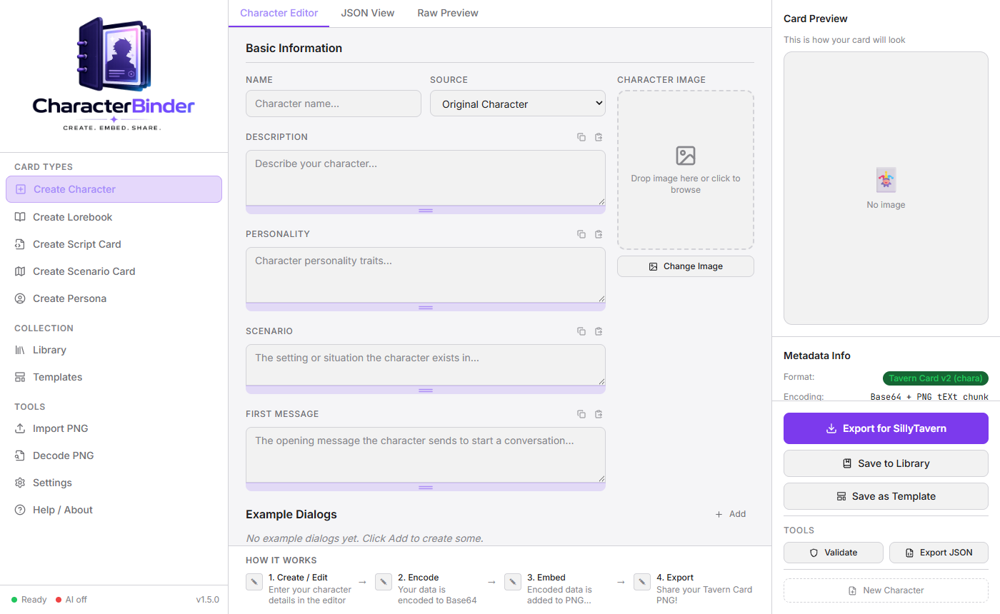

# CharacterBinder

> Create, embed, share — a local-first desktop tool for building and exporting AI roleplay character cards in the Tavern Card PNG format.



---

## Quick Start

### Prerequisites

- [Node.js](https://nodejs.org) v18 or later
- [Rust](https://rustup.rs) — only needed for the Tauri desktop build

### Install & Run — no terminal needed

Download or clone the repo, then:

- **Windows** — double-click **`start.bat`**
- **macOS / Linux** — run **`./start.sh`**

The script checks that Node.js is present and new enough, installs dependencies
on first run, starts the server, and opens your browser. If CharacterBinder is
already running it just opens the tab instead of starting a second copy. If
Node.js is missing it tells you where to get it rather than showing a stack
trace.

Keep the window open while you work; closing it stops the app.

### Install & Run — from a terminal

```bash
git clone https://github.com/Fablestarexpanse/CharacterBinder.git
cd CharacterBinder
npm install
npm start
```

Opens at **[http://localhost:3737](http://localhost:3737)** in your browser. No Rust required for the web version.

(`npm start` opens the browser for you; `npm run dev` is the same thing without that.)

### Desktop App (Tauri)

Runs in its own window instead of a browser tab. Needs [Rust](https://rustup.rs)
in addition to Node.js — the first launch compiles it and takes a few minutes.

- **Windows** — double-click **`start-desktop.bat`**
- **macOS / Linux** — run **`./start-desktop.sh`**

Or from a terminal:

```bash
npm run desktop
```

### Production Build

```bash
# Web — outputs to dist/
npm run build

# Desktop installer
npm run tauri build
```

---

## What Is CharacterBinder?

CharacterBinder lets you build character cards compatible with **SillyTavern**, **JanitorAI**, **Chub.ai**, **Agnai**, **Venus AI**, **Backyard AI**, **RisuAI**, and generic platforms — all from a clean, focused editor.

Character data is embedded directly into a PNG image as hidden metadata (Base64-encoded JSON in a `tEXt` chunk). The resulting file looks like a normal image but carries the full character definition inside it, ready to be dropped into any compatible platform.

**Everything runs locally. No accounts. No cloud. No data leaves your machine.**

*Two asterisks, both opt-in and both off by default: the Quick Import AI sorter
downloads a model file from Hugging Face the first time you use it (your text is
not sent — the model comes to you), and you can deliberately point that sorter at
a remote API instead, which does send your text and warns you before it will.*

---

## Features

### Character Editor
- Fill in all Tavern Card v2 fields: name, description, personality, scenario, first message, example dialogs, system prompt, post-history instructions, and more
- Live character image preview with drag-and-drop support
- Alternate greetings — add multiple opening messages
- Tags, creator fields, character version, and creator notes
- Copy / Paste buttons on every text field with cursor-aware insertion
- JSON View and Raw Preview tabs for direct inspection
- Live token counter (cl100k / GPT-4 standard) with per-field breakdown

### Lorebook Editor
- Build SillyTavern-compatible world info / knowledge books
- Add and manage entries with keyword triggers (primary + secondary), priority, insertion order, and position
- Per-entry toggles: enabled, constant, selective, case-sensitive
- Import existing SillyTavern lorebook JSON via drag-and-drop or file picker
- Creator, version, and creator notes fields
- Export as SillyTavern-compatible JSON or embed in a PNG (`lorebook` chunk)

### Script Card Editor
- Package JavaScript snippets or system prompts as portable, shareable cards
- Full-height code editor with line numbers, syntax highlighting colours, and Tab key support
- Author, version, creator notes, and tags
- Export as JSON or embed in a PNG (`script` chunk)

### Scenario Card Editor
- Create a standalone situation or setting card that can be dropped into any conversation
- Fields: scenario text, opening message, creator, version, creator notes, and tags
- Optional scene image with drag-and-drop support
- Export as JSON or embed in a PNG (`scenario` chunk)

### Persona Card Editor *(v1.4)*
- Define a user persona — who *you* are in the conversation, used as the `{{user}}` identity
- **Quick Import** — paste one unsorted block of text and it gets split into the right fields (see below)
- Fields: name, description, personality, appearance, background, creator, version, creator notes, and tags
- Avatar image with drag-and-drop support
- Export as JSON or embed in a PNG (`persona` chunk)

### Quick Import — paste anything, get sorted fields *(Persona editor)*


Personas collected from JanitorAI and elsewhere rarely arrive neatly split into
Appearance / Personality / Background. Quick Import takes one blob of text in
whatever shape you have it and proposes a field-by-field split, which you review
and adjust before anything is applied.

It picks its own approach based on what you paste:

| Your text | What happens |
|-----------|--------------|
| Section headings — `Appearance:`, `## Personality`, or a bare `Background` line | Split on those headings, instantly, **word-for-word** |
| A JSON card export (including Tavern V2 `data` nesting) | Mapped by key |
| W++ — `Personality("aloof" + "witty")` | Parsed as an attribute list |
| Shapeless prose with no structure at all | Read by a local AI model that can split one sentence across three fields |

**Nothing is ever lost.** Sections it doesn't recognise — `Age`, `Gender`,
`Likes` — are kept in Description with their labels intact. Several sections
that belong to one field (`Habits`, `Interests`, `Strengths`, `Flaws` all being
personality) are merged with their original labels preserved, so the result
stays readable.

Before applying you get a checkbox per field to drop anything it got wrong, and
a Replace / Keep-and-append choice for fields you've already filled in.

#### The AI sorter
Only used when your text has no structure to work from, because for structured
text the parser is both faster and more faithful.

The model runs **in your browser on your GPU via WebGPU** — your persona text is
never sent anywhere. It downloads once from Hugging Face (Llama 3.2 3B by
default, about 2.2 GB) and is cached, so it works offline afterwards. A typical
sort takes ~2 seconds once loaded. Output is constrained to a JSON schema during
decoding, so the model cannot return malformed or off-schema results.

Under the gear icon you can pick a smaller model (down to 376 MB) for weaker
machines, or point the sorter at any OpenAI-compatible server instead — Ollama,
LM Studio, KoboldCpp, TabbyAPI. Non-local addresses require an explicit
acknowledgement first, since that is the one path where your text leaves the
machine.

### Card Library
- Save all card types locally in your browser's IndexedDB — no files to manage
- Browse your collection in a thumbnail grid organised by type (Characters, Lorebooks, Scripts, Scenarios, Personas)
- **Version badges** — each card tile shows its version number
- **Clickable tags** — click any tag on a card to instantly filter the library by that tag
- Search by name, type, or tag with a one-click clear button
- Sort by last modified, created date, or name
- Multi-select for bulk delete or export

### Version Control in Library *(v1.4)*
- Changing a card's version number and pressing **Save to Library** creates a **new entry** instead of overwriting the existing one
- Previous versions stay in your library side-by-side
- Works across all card types

### Archive & Export
- **Export ZIP** — download selected cards (or your entire library) as a single `.zip` file
- Each card exports as a `.png` (with embedded metadata) or `.json` (if no image)
- A `manifest.json` is included listing all cards, types, and timestamps
- Perfect for backing up your collection or moving it to another machine

### Multi-Platform Export (Character Cards)
- Switch target platforms and see live field compatibility warnings before you export
- Automatic field mapping and renaming per platform
- PNG export or JSON export depending on platform support
- Save as Template directly from the export panel

### Tools
- **Import PNG** — load any card PNG (character, lorebook, script, scenario, or persona) and open it in the correct editor automatically
- **Decode PNG** — inspect the raw embedded metadata of any card PNG, with full chunk listing and decoded JSON
- **Templates** — start from a built-in character or a blank slate
- **Validate** — check your character card against the Tavern Card v2 spec before exporting

---

## Supported Platforms

**PNG and JSON export are always available for every platform.** The table below
is about what each *site* can import, not about what CharacterBinder will let you
save — if a platform can't read PNG cards, you still get the PNG, along with a
warning telling you to upload the JSON to that particular site.

| Platform | Reads PNG cards | Reads JSON | Metadata Key |
|----------|-----------------|------------|--------------|
| SillyTavern | ✅ | ✅ | `chara` |
| JanitorAI | ❌ JSON only | ✅ | `chara` |
| Chub.ai | ✅ | ✅ | `chara` |
| Agnai | ❌ JSON only | ✅ | `chara` |
| Venus AI | ✅ | ✅ | `chara` |
| Backyard AI | ❌ JSON only | ✅ | `chara` |
| RisuAI | ✅ | ✅ | `chara` |
| Generic | ✅ | ✅ | `character` |

A PNG exported while targeting a JSON-only platform is still a complete, valid
card — the data is embedded in a `chara` chunk exactly as it would be anywhere
else, so it imports fine into SillyTavern, Chub, RisuAI, or back into
CharacterBinder. It's a convenient way to archive or share the card as a single
image even when the destination site needs the JSON.

Field compatibility is shown live in the editor when you switch target platforms.

---

## PNG Metadata Keys

Each card type uses a dedicated `tEXt` chunk keyword so apps can identify the content:

| Card Type | Metadata Key |
|-----------|-------------|
| Character Card | `chara` |
| Lorebook | `lorebook` |
| Script Card | `script` |
| Scenario Card | `scenario` |
| Persona | `persona` |

Character cards exported with the **Generic / Other** platform selected use
`character` instead of `chara`. On import, CharacterBinder reads `chara`,
`character`, `tavern`, and `tavern_card_v2` for character cards, so files from
other tools are picked up regardless of which of those they used.

---

## How PNG Embedding Works

1. Your card data is serialized as a JSON object
2. The JSON string is Base64-encoded (Unicode-safe)
3. A PNG `tEXt` chunk is inserted into the image with the appropriate keyword
4. The resulting PNG is visually identical to the original but carries the full card data invisibly

```
PNG Signature (8 bytes)
→ IHDR chunk
→ tEXt chunk: "chara" = Base64(JSON)   ← card data lives here
→ IDAT chunks (pixel data)
→ IEND chunk
```

---

## Tech Stack

| Layer | Technology |
|-------|-----------|
| Desktop shell | [Tauri 2.x](https://tauri.app) (Rust) |
| Frontend | React 18 + TypeScript |
| Styling | Tailwind CSS |
| Build tool | Vite |
| Local storage | IndexedDB via [idb](https://github.com/jakearchibald/idb) |
| ZIP export | [JSZip](https://stuk.github.io/jszip/) |
| PNG encoding | Pure JavaScript (no native deps) |
| Token counting | [gpt-tokenizer](https://github.com/niieani/gpt-tokenizer) (cl100k) |
| In-browser AI | [WebLLM](https://github.com/mlc-ai/web-llm) on WebGPU (lazy-loaded, optional) |

---

## Project Structure

```
CharacterBinder/
├── src/
│   ├── components/          # UI components (editors, sidebar, library, modals)
│   ├── hooks/               # Shared React hooks (status messages, AI engine state)
│   ├── lib/
│   │   ├── pngMetadata/     # PNG tEXt chunk encoder/decoder
│   │   ├── platforms/       # Platform definitions + format converters
│   │   ├── cardFormats/     # Card-type detection and shared shapes
│   │   ├── validators/      # Card validation logic
│   │   ├── exporters/       # PNG/JSON download helpers
│   │   ├── library/         # IndexedDB card storage (idb)
│   │   ├── archive/         # ZIP export (jszip)
│   │   ├── tokenizer/       # Token counting (cl100k)
│   │   ├── personaParser/   # Quick Import: labelled / JSON / W++ / prose parsing
│   │   ├── personaLlm/      # Quick Import: in-browser AI sorter (WebLLM) + settings
│   │   ├── customTemplates/ # User-saved templates (localStorage)
│   │   ├── minimalPng.ts    # 1×1 placeholder PNG for image-less cards
│   │   └── readImageFile.ts # Image file → data URL helper
│   ├── data/templates/      # Built-in character templates
│   ├── types/               # TypeScript type definitions
│   ├── index.css            # Tailwind layers + shared component classes
│   ├── main.tsx             # React entry point
│   └── App.tsx              # Root component and app state
├── src-tauri/               # Tauri (Rust) desktop shell
├── public/                  # Static assets (logo, etc.)
├── docs/                    # Screenshots and documentation assets
├── start.bat / start.sh                 # One-click launch (browser)
└── start-desktop.bat / start-desktop.sh # One-click launch (desktop window)
```

---

## Changelog

### v1.5.0
- Added **Quick Import** to the Persona editor — paste one unsorted block of text and it is split into name, description, personality, appearance, background, and tags, with a reviewable preview before anything is applied
- Handles labelled sections (including bare headings and `⸻` dividers), markdown headings, W++ attribute lists, and JSON card exports; unrecognised sections are preserved in Description rather than dropped
- Added an **in-browser AI sorter** for text with no structure at all — runs on WebGPU via [WebLLM](https://github.com/mlc-ai/web-llm), so persona text never leaves the machine; schema-constrained decoding guarantees well-formed output
- Optional OpenAI-compatible endpoint (Ollama, LM Studio, KoboldCpp) as an alternative to the in-browser model, with an explicit warning before any non-local address is used
- **PNG export is no longer blocked** for platforms that can't import PNG cards (JanitorAI, Agnai, Backyard AI) — the button always works and an inline warning explains that the site needs the JSON, instead of the export being greyed out
- Corrected the platform table: JanitorAI was documented as supporting PNG import, which it does not
- Fixed `npm run tauri dev` — `devUrl` pointed at port 1420 while Vite serves 3737, so the desktop shell could never connect
- Added one-click `start` / `start-desktop` scripts for Windows, macOS, and Linux that check prerequisites, install dependencies on first run, and detect an already-running server instead of failing on a port clash
- Added `npm start` (dev server + opens browser) and `npm run desktop` aliases, plus a `node >=18` engines constraint
- Added `.gitattributes` pinning `*.sh` to LF — without it a Windows checkout produced CRLF shebangs that fail on macOS/Linux with `bad interpreter`
- The version shown in the sidebar and Help / About is now injected from `package.json` at build time instead of being hardcoded in two components, where it had already drifted a release behind

### v1.4.0
- Added **Persona Card Editor** — define a user persona (`{{user}}` identity) with name, description, personality, appearance, background, avatar image, and PNG/JSON export
- All card types now include **Creator / Author**, **Version**, and **Creator Notes** fields
- **Version-as-new-record** — changing a card's version and saving to library creates a new entry instead of overwriting, preserving all previous versions
- **Library version badges** — each card tile now shows its version number
- **Clickable tag search** — click any tag on a library card to filter by it instantly
- **Auto-filename sync** — output filename updates live as you type the card name across all editors
- **Import PNG** and **Decode PNG** now detect and load all card types (lorebook, script, scenario, persona)
- Removed sidebar token counts from Script and Lorebook editors (cleaner export panel)
- Starts blank by default — no pre-loaded example character

### v1.3.0
- Added **Lorebook Editor** — build SillyTavern-compatible world info books with keyword-triggered entries, priority/insertion order controls, and JSON export
- Added **Script Card Editor** — package system prompts and instruction sets as portable cards (JSON + optional PNG embed)
- Added **Scenario Card Editor** — create standalone scenario cards with optional scene image, opening message, and JSON + PNG export
- Multi-type support in Import PNG and Decode PNG
- Navigation sidebar reorganised into grouped sections: Card Types, Collection, Tools

### v1.2.0
- Added **Token Counter** — live per-field token counts (cl100k / GPT-4 standard) with a total budget bar and breakdown panel
- Added **Save as Template** — save any card as a reusable template from the export panel
- Added **Copy / Paste buttons** on every text field — paste inserts at cursor position
- Removed character limits on all text fields

### v1.1.0
- Added **Card Library** — save, browse, search, and manage your cards locally
- Added **ZIP Archive** — export selected or all cards as a portable `.zip` with manifest
- Multi-select bulk operations

### v1.0.0
- Initial release — character editor, multi-platform export, PNG encoding/decoding, templates

---

## License

MIT — free to use, modify, and distribute.

---

*CharacterBinder is an independent open-source project and is not affiliated with SillyTavern or any other platform.*
