# CharacterBinder

> Create, embed, share — a local-first tool for building and exporting AI roleplay character cards in the Tavern Card PNG format. Runs entirely in your browser.

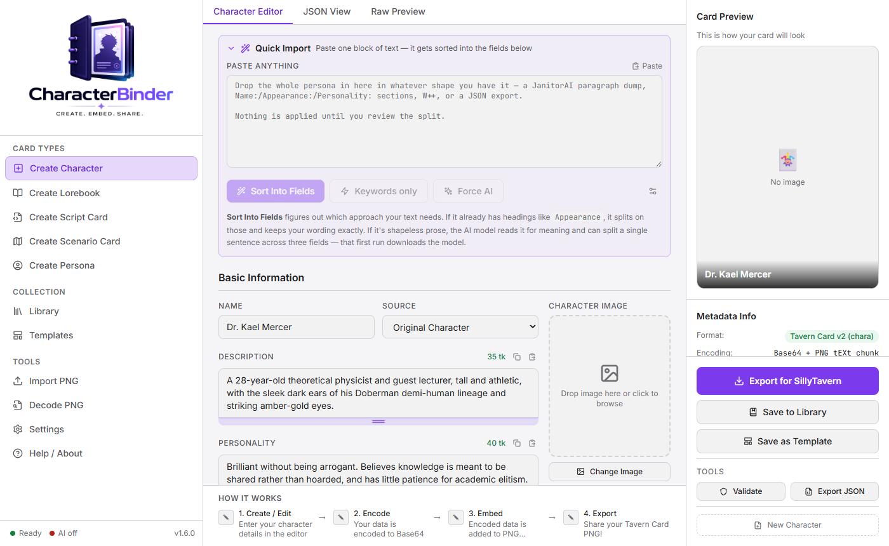

---

## Quick Start

### Prerequisites

- [Node.js](https://nodejs.org) v18 or later — that's the whole list

### Install & Run — no terminal needed

Download or clone the repo, then:

- **Windows** — double-click **`start.bat`**
- **macOS / Linux** — run **`./start.sh`**

The script checks that Node.js is present and new enough, installs dependencies
on first run, starts the server, and opens your browser. If CharacterBinder is
already running it just opens the tab instead of starting a second copy. If
Node.js is missing it tells you where to get it rather than showing a stack
trace.

Keep the window open while you work; closing it stops the app.

### Install & Run — from a terminal

```bash
git clone https://github.com/Fablestarexpanse/CharacterBinder.git
cd CharacterBinder
npm install
npm start
```

Opens at **[http://localhost:3737](http://localhost:3737)** in your browser.

(`npm start` opens the browser for you; `npm run dev` is the same thing without that.)

### Production Build

```bash
npm run build
```

Outputs a static site to `dist/`. It has no server component, so it can be
opened from any static host — GitHub Pages, Netlify, or a folder behind nginx.

### Running the tests

```bash
npm test
```

Components and hooks run under jsdom; the pure modules run in plain Node, so they
stay fast.

The MCP server is its own package with its own suite — the bridge handshake is
driven over a real socket there:

```bash
npm --prefix mcp test
```

---

## What Is CharacterBinder?

CharacterBinder lets you build character cards compatible with **SillyTavern**, **JanitorAI**, **Chub.ai**, **Agnai**, **Venus AI**, **Backyard AI**, **RisuAI**, and generic platforms — all from a clean, focused editor.

Character data is embedded directly into a PNG image as hidden metadata (Base64-encoded JSON in a `tEXt` chunk). The resulting file looks like a normal image but carries the full character definition inside it, ready to be dropped into any compatible platform.

**Everything runs locally. No accounts. No cloud. No data leaves your machine.**

*Two asterisks, both opt-in and both off by default: the Quick Import AI sorter
downloads a model file from Hugging Face the first time you use it (your text is
not sent — the model comes to you), and you can deliberately point that sorter at
a remote API instead, which does send your text and warns you before it will.*

---

## Features

The sidebar splits into three groups — **Card Types** to make things, **Collection**
to keep them, and **Tools** for everything else. Each section is covered below.

---

### Character Editor

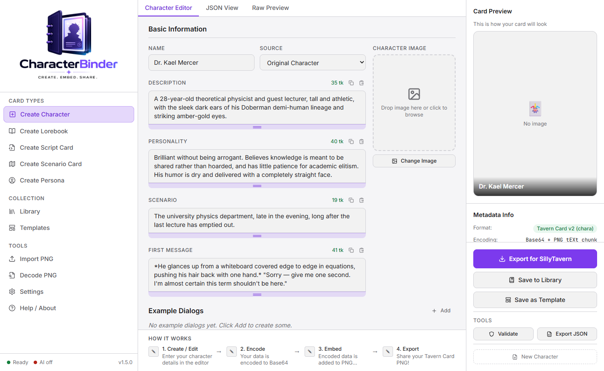

The main editor. Every Tavern Card v2 field is here — description, personality,
scenario, first message, example dialogs, and the advanced block (system prompt,
post-history instructions, alternate greetings, lorebook).

**Quick Import** sits at the top — paste an unsorted card and it fills the fields
for you (see below).

The right rail stays live as you type: card preview, embedded data size, a token
counter with per-field breakdown, and validation. Pick a target platform and it
tells you which of your fields that platform will drop or rename *before* you
export. **JSON View** and **Raw Preview** tabs show exactly what will be written.

---

### Lorebook Editor

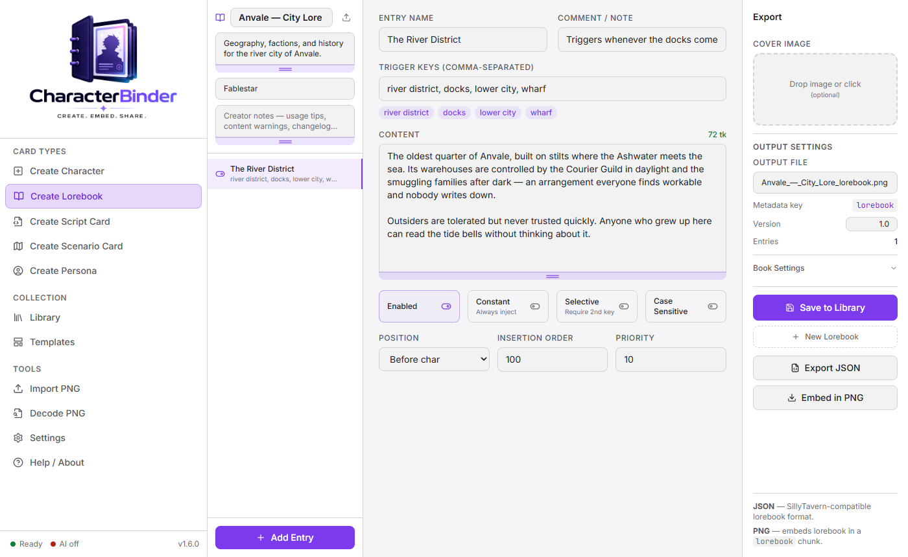

Builds SillyTavern-compatible world info books. Entries live in a list on the
left; each one gets trigger keys, content, and an internal note.

Per-entry controls cover **enabled**, **constant** (always inject), **selective**
(require a second key), and **case sensitive**, plus position, insertion order,
and priority. Existing SillyTavern lorebook JSON can be dragged straight in.

---

### Script Card Editor

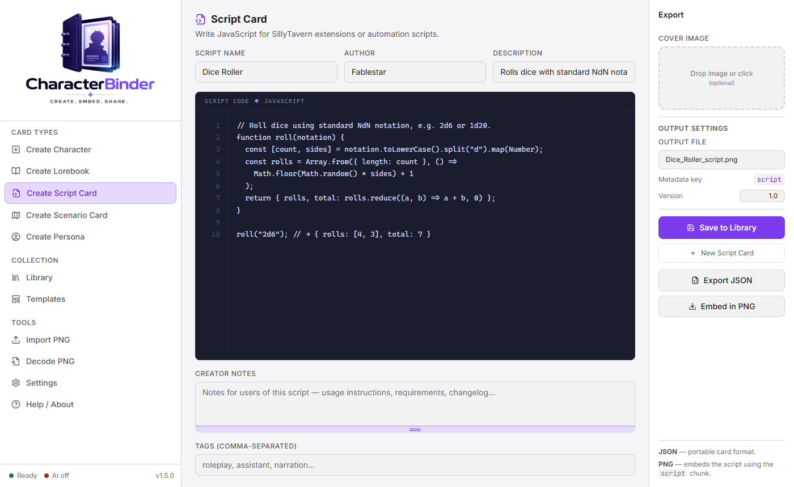

Packages JavaScript snippets or system prompts as portable cards. The code
editor has line numbers, syntax colouring, and Tab support.

Exports as JSON, or embeds into a PNG using the `script` chunk so a script can
be shared as a single image like any other card.

---

### Scenario Card Editor

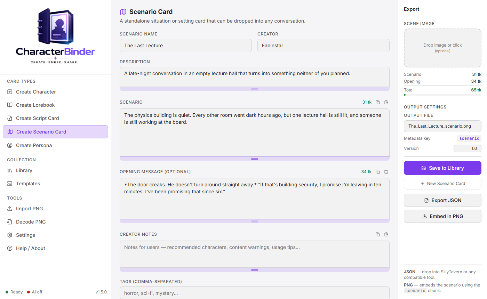

A standalone situation that can be dropped into any conversation, independent of
which character you're talking to. Scenario text, an opening message, an optional
scene image, and the usual creator/version/notes fields.

---

### Persona Card Editor

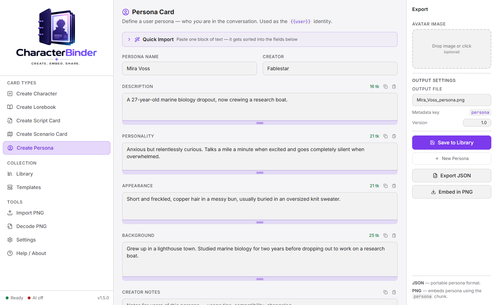

Defines who *you* are in the conversation — the `{{user}}` identity. Name,
description, personality, appearance, background, and an avatar.

Above the fields sits **Quick Import**, which is the fastest way to fill this in.

---

### Quick Import — paste anything, get sorted fields

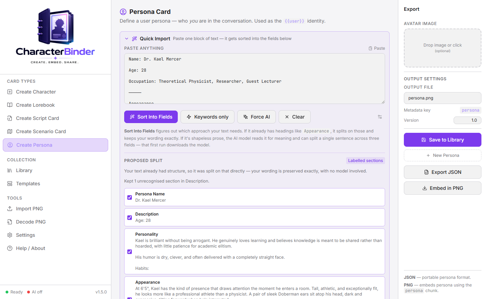

Available in both the **Character** and **Persona** editors.

Cards collected from JanitorAI and elsewhere rarely arrive neatly split into
fields. Quick Import takes one blob of text in whatever shape you have it and
proposes a field-by-field split, which you review and adjust before anything is
applied.

It targets whichever card you're editing: a persona gets appearance and
background, a character card gets scenario, first message, and example dialogue
instead — and any appearance or backstory it finds gets folded into the
character's description with its heading kept, rather than dropped.

It picks its own approach based on what you paste:

| Your text | What happens |
|-----------|--------------|
| Section headings — `Appearance:`, `## Personality`, or a bare `Background` line | Split on those headings, instantly, **word-for-word** |
| A JSON card export (including Tavern V2 `data` nesting) | Mapped by key |
| W++ — `Personality("aloof" + "witty")` | Parsed as an attribute list |
| Shapeless prose with no structure at all | Read by a local AI model that can split one sentence across three fields |

**Nothing is ever lost.** Sections it doesn't recognise — `Age`, `Gender`,
`Likes` — are kept in Description with their labels intact. Several sections
that belong to one field (`Habits`, `Interests`, `Strengths`, `Flaws` all being
personality) are merged with their original labels preserved, so the result
stays readable.

Before applying you get a checkbox per field to drop anything it got wrong, and
a Replace / Keep-and-append choice for fields you've already filled in.

#### The AI sorter

Only used when your text has no structure to work from, because for structured
text the parser is both faster and more faithful.

The model runs **in your browser on your GPU via WebGPU** — your persona text is
never sent anywhere. It downloads once from Hugging Face (Llama 3.2 3B by
default, about 2.2 GB) and is cached, so it works offline afterwards. A typical
sort takes ~2 seconds once loaded. Output is constrained to a JSON schema during
decoding, so the model cannot return malformed or off-schema results.

The `AI` light next to **Ready** in the sidebar shows whether the model is
currently loaded, and clicking it loads or frees it — worth knowing, since a
resident model holds a couple of GB of VRAM. Under the gear icon you can pick a
smaller model (down to 376 MB), or point the sorter at any OpenAI-compatible
server instead — Ollama, LM Studio, KoboldCpp, TabbyAPI. Non-local addresses
require an explicit acknowledgement first, since that is the one path where your
text leaves the machine.

---

### Library

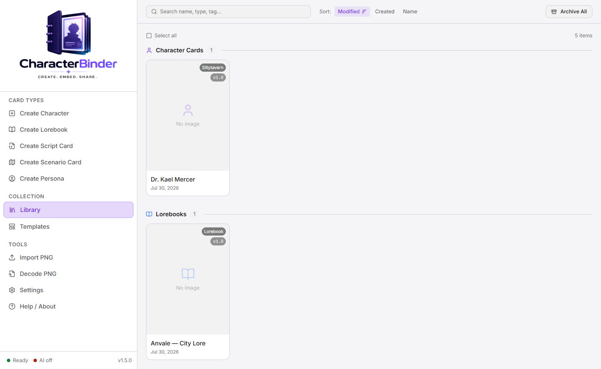

Everything you save lives here, in your browser's IndexedDB — no files to manage.
Cards are grouped by type and tagged with their version.

Search by name, type, or tag; sort by modified, created, or name; click any tag
on a card to filter by it. Multi-select supports bulk delete and bulk export, and
**Archive All** drops your whole collection into a single `.zip` with a
`manifest.json` — the easiest way to back up or move to another machine.

**Version control:** change a card's version number before saving and you get a
*new* library entry instead of overwriting the old one, so previous versions stay
side by side. Works across all five card types.

---

### Templates

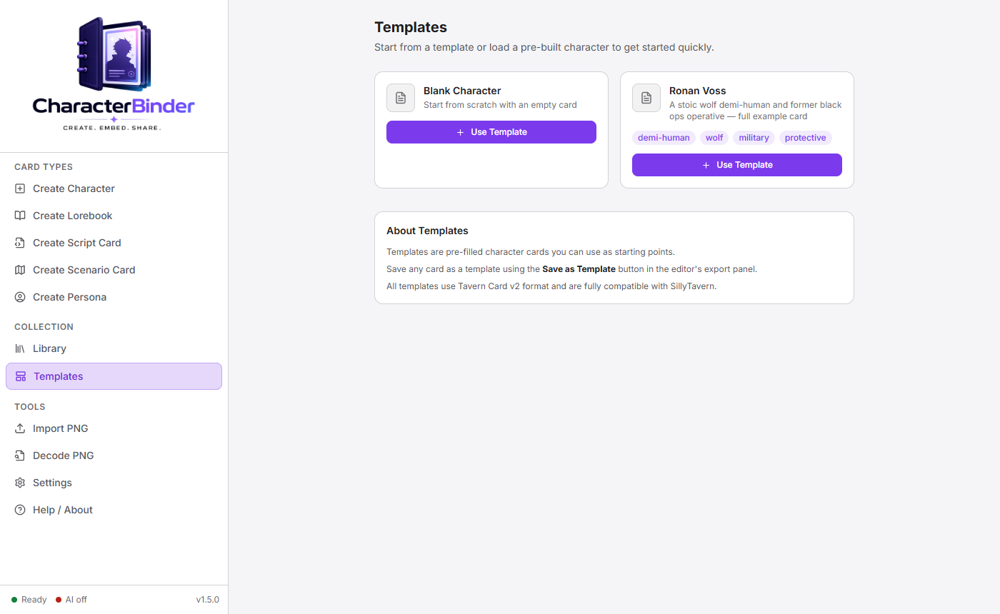

Start from a built-in character instead of a blank editor. Anything you build can
be saved here too, via **Save as Template** in the character export panel.

---

### Import PNG

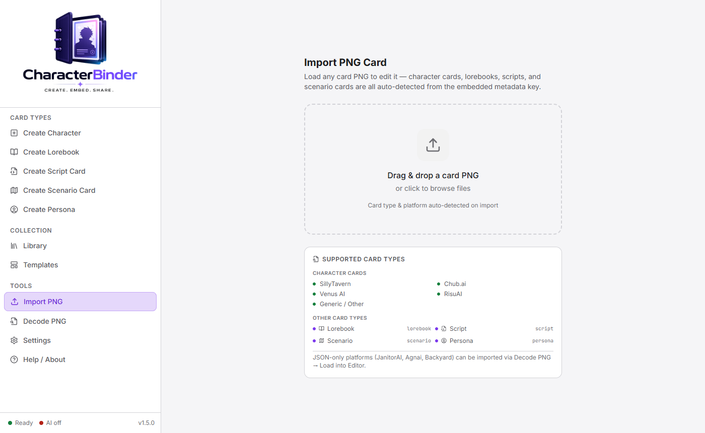

Drop in any card PNG and it opens in the right editor automatically. It detects
all five card types by their metadata chunk, so a lorebook PNG lands in the
Lorebook editor and a persona lands in the Persona editor without being told.

---

### Decode PNG

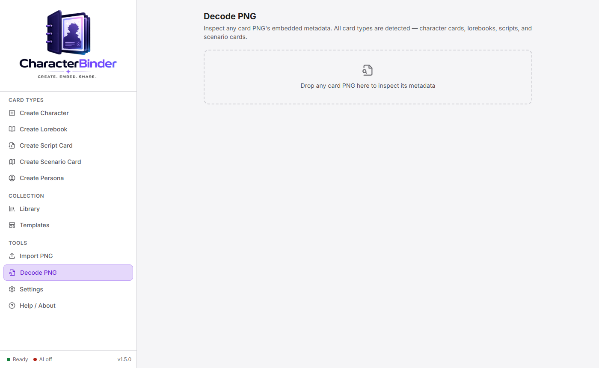

The inspector. Shows every `tEXt` chunk in a card PNG and the decoded JSON behind
it — useful for checking what a card you downloaded actually contains, or for
confirming your own export came out right.

---

### Settings

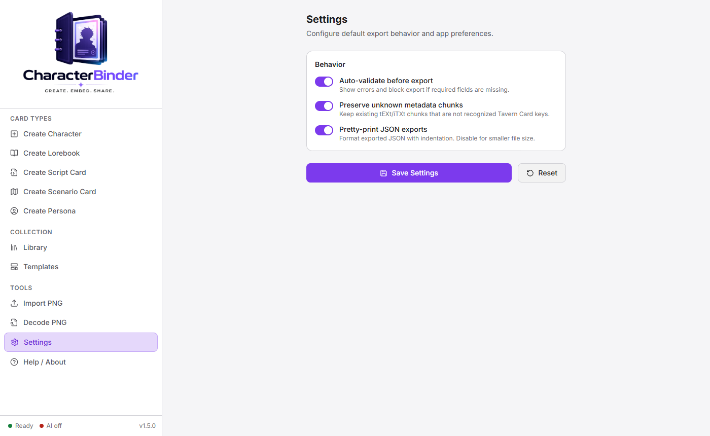

App preferences: validate before exporting, pretty-print JSON, and whether to
preserve unknown PNG chunks when re-encoding an existing image.

---

### Help / About

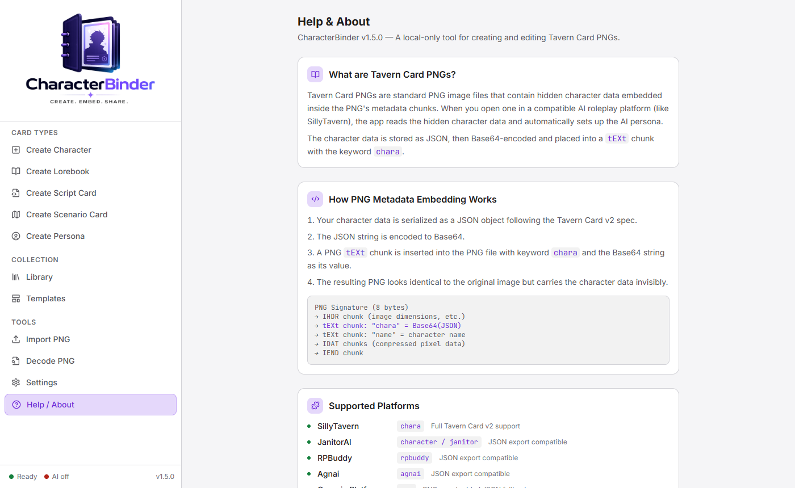

A short primer on what Tavern Card PNGs are and how the embedding works, plus the
current version.

---

## MCP Server — let a coding agent build cards

CharacterBinder ships an [MCP](https://modelcontextprotocol.io) server, so Claude
Code, Claude Desktop, or any MCP client can create and edit cards in your library
directly. Ask for *"a stoic dwarven blacksmith with a lorebook for his forge"* and
the cards appear in the app, already open in the editor.

Everything stays on your machine. The server listens on `127.0.0.1` only and is
off until you switch it on.

### How it fits together

Your library lives in the browser's IndexedDB, which a Node process can't reach.
So the app is the source of truth and the MCP server proxies to it:

```
Claude Code ──stdio──> CharacterBinder MCP server ──ws://127.0.0.1:8787──> the app
                                                                            └─ IndexedDB
```

Card tools need the app open with the bridge switched on. Validation, platform
compatibility, and text parsing are pure and work regardless — those reuse the
app's own modules, so they can't drift from what the UI does.

### Install it for me

Paste this into Cowork (or Claude Code) from anywhere and it will do the whole
setup, including registering the server with your client:

```text
Set up the CharacterBinder MCP server for me.

1. Clone https://github.com/Fablestarexpanse/CharacterBinder.git if I don't
   already have it, then cd into it.
2. Run `npm install`, then `cd mcp && npm install && npm run build`.
3. Register the server with my MCP client using the absolute path to
   mcp/dist/index.js, running it with `node`. Name it "characterbinder".
   - For Claude Code, run: claude mcp add characterbinder -- node <abs-path>
   - For Claude Desktop, add it to claudeDesktopConfig.json under mcpServers
     instead, then tell me to restart the app.
4. Start the app with `npm start` from the repo root. Tell me the pairing token
   the MCP server printed (it is also in ~/.characterbinder/bridge-token), and
   tell me to paste it into Settings → MCP bridge and then click the MCP light
   in the sidebar footer.
5. Verify by calling the app_status tool and report what it says.

Tell me if anything is already installed so you don't redo it.
```

### Install it manually

```bash
git clone https://github.com/Fablestarexpanse/CharacterBinder.git
cd CharacterBinder
npm install
cd mcp && npm install && npm run build
```

Register it with Claude Code:

```bash
claude mcp add characterbinder -- node /absolute/path/to/CharacterBinder/mcp/dist/index.js
```

Or for Claude Desktop, in `claude_desktop_config.json`:

```json
{
  "mcpServers": {
    "characterbinder": {
      "command": "node",
      "args": ["/absolute/path/to/CharacterBinder/mcp/dist/index.js"]
    }
  }
}
```

Then:

1. Start the app (`npm start` from the repo root)
2. Copy the pairing token from `~/.characterbinder/bridge-token` into
   **Settings → MCP bridge**. The server prints it the first time it mints one,
   and after that only names the file — a standing secret does not belong in
   every agent transcript.
3. Click the **MCP** light in the sidebar footer — it turns green once paired

### Tools

| Tool | What it does |
|------|--------------|
| `app_status` | Whether the app is connected. Call this first if anything errors |
| `list_cards` | Everything in the library, filterable by type |
| `get_card` | One card in full |
| `create_character` | A Tavern Card v2 character |
| `create_persona` | A `{{user}}` persona |
| `create_lorebook` | A world info book, entries and all |
| `create_scenario` | A standalone situation card |
| `create_script` | A script card |
| `update_card` | Shallow-merge edits into an existing card — you approve each one |
| `delete_card` | Remove a card — no undo, and you approve each one |
| `open_card` | Bring a card up in the app's editor |
| `validate_character` | Check against the Tavern v2 spec |
| `platform_compatibility` | What a given platform drops or renames |
| `parse_card_text` | Sort a pasted blob into fields — the Quick Import parser |

Creating a card opens it in the app by default, so you can see what the agent
made. Pass `open: false` to work quietly in the background.

### Security

The bridge exposes your card library to whatever is connected — it can read, edit,
and delete. What keeps that bounded:

- **A shared pairing token, proved in both directions.** The server mints one on
  first run and stores it in `~/.characterbinder/bridge-token`; you paste it into
  Settings once. Neither side ever transmits it — each proves it holds it by
  HMAC-ing the other's nonce, and the *server* proves itself first, so the app
  never hands its secret to an unverified peer. The app refuses to go on until
  that proof checks out: a process that grabs the port and simply declares
  itself ready is closed on, not answered.
- **One connection at a time.** A second connection is refused rather than being
  allowed to displace a live session.
- **Origin checking.** Connections from a browser origin that isn't the app are
  rejected at the HTTP upgrade.
- **You approve every destructive call.** Overwriting or deleting a card raises the
  same confirmation the app itself uses, naming the card; declining returns an
  error to the agent. Creating a new card does not prompt — nothing is lost by it.
  If the bridge drops while a prompt is open, the prompt is refused rather than
  applied to a caller that has gone away.
- **Loopback only**, off by default, with the sidebar light as the only switch and
  a running count of requests served.

An earlier version of this section claimed the loopback bind alone kept the bridge
bounded. That was wrong: on a desktop, loopback is a shared trust boundary, not an
authentication boundary. Any local process could have bound the port first and
impersonated the server, and any web page could have connected — `ws://` to
loopback is exempt from mixed-content blocking and isn't subject to CORS. The
token handshake above is what actually closes that.

Turn it off when you're not using it.

---

## Supported Platforms

**PNG and JSON export are always available for every platform.** The table below
is about what each *site* can import, not about what CharacterBinder will let you
save — if a platform can't read PNG cards, you still get the PNG, along with a
warning telling you to upload the JSON to that particular site.

| Platform | Reads PNG cards | Reads JSON | Metadata Key |
|----------|-----------------|------------|--------------|
| SillyTavern | ✅ | ✅ | `chara` |
| JanitorAI | ❌ JSON only | ✅ | `chara` |
| Chub.ai | ✅ | ✅ | `chara` |
| Agnai | ❌ JSON only | ✅ | `chara` |
| Venus AI | ✅ | ✅ | `chara` |
| Backyard AI | ❌ JSON only | ✅ | `chara` |
| RisuAI | ✅ | ✅ | `chara` |
| Generic | ✅ | ✅ | `character` |

A PNG exported while targeting a JSON-only platform is still a complete, valid
card — the data is embedded in a `chara` chunk exactly as it would be anywhere
else, so it imports fine into SillyTavern, Chub, RisuAI, or back into
CharacterBinder. It's a convenient way to archive or share the card as a single
image even when the destination site needs the JSON.

Field compatibility is shown live in the editor when you switch target platforms.

---

## PNG Metadata Keys

Each card type uses a dedicated `tEXt` chunk keyword so apps can identify the content:

| Card Type | Metadata Key |
|-----------|-------------|
| Character Card | `chara` |
| Lorebook | `lorebook` |
| Script Card | `script` |
| Scenario Card | `scenario` |
| Persona | `persona` |

Character cards exported with the **Generic / Other** platform selected use
`character` instead of `chara`. On import, CharacterBinder reads `chara`,
`character`, `tavern`, and `tavern_card_v2` for character cards, so files from
other tools are picked up regardless of which of those they used.

---

## How PNG Embedding Works

1. Your card data is serialized as a JSON object
2. The JSON string is Base64-encoded (Unicode-safe)
3. A PNG `tEXt` chunk is inserted into the image with the appropriate keyword
4. The resulting PNG is visually identical to the original but carries the full card data invisibly

```
PNG Signature (8 bytes)
→ IHDR chunk
→ tEXt chunk: "chara" = Base64(JSON)   ← card data lives here
→ IDAT chunks (pixel data)
→ IEND chunk
```

---

## Tech Stack

| Layer | Technology |
|-------|-----------|
| Runtime | The browser — no server, no native shell |
| Frontend | React 18 + TypeScript |
| Styling | Tailwind CSS |
| Build tool | Vite |
| Local storage | IndexedDB via [idb](https://github.com/jakearchibald/idb) |
| ZIP export | [JSZip](https://stuk.github.io/jszip/) |
| PNG encoding | Pure JavaScript (no native deps) |
| Token counting | [gpt-tokenizer](https://github.com/niieani/gpt-tokenizer) (cl100k) |
| In-browser AI | [WebLLM](https://github.com/mlc-ai/web-llm) on WebGPU (lazy-loaded, optional) |
| Agent access | [MCP](https://modelcontextprotocol.io) server over stdio, bridged to the app on loopback |

---

## Project Structure

```
CharacterBinder/
├── src/
│   ├── components/
│   │   ├── pages/           # The views App mounts (editors, library, import, settings)
│   │   ├── editor/          # Panels owned by one page (card preview, smart import, lights)
│   │   └── ui/              # Shared primitives (inputs, modals, dropzone, JSON views)
│   ├── hooks/               # Shared React hooks (card editor shell, status messages, AI engine state)
│   ├── shared/              # Browser-neutral: the only code mcp/ may import
│   │   ├── bridgeProtocol.ts # Wire protocol, shared by both sides of the bridge
│   │   ├── platforms/       # Platform definitions + format converters
│   │   ├── validators.ts    # Card validation logic
│   │   ├── cardTextParser.ts # Quick Import: labelled / JSON / W++ / prose parsing
│   │   ├── tavernCard.ts    # Blank Tavern Card v2 factory
│   │   └── errorMessage.ts  # The message from a caught unknown
│   ├── lib/                 # Browser-only: IndexedDB, localStorage, DOM, WebGPU
│   │   ├── bridge/          # MCP bridge: the app-side client
│   │   ├── cardTextSorter/  # Quick Import: in-browser AI sorter (WebLLM) + settings
│   │   ├── pngMetadata.ts   # PNG tEXt chunk encoder/decoder
│   │   ├── library.ts       # IndexedDB card storage (idb)
│   │   ├── archive.ts       # ZIP export (jszip)
│   │   ├── tokenizer.ts     # Token counting (cl100k)
│   │   ├── customTemplates.ts # User-saved templates (localStorage)
│   │   ├── lorebook.ts      # Lorebook shapes: editor form ↔ interchange format
│   │   ├── blankCards.ts    # Empty cards + coercion of untrusted card bodies
│   │   ├── persistedSettings.ts # localStorage-backed settings store
│   │   ├── carrierImage.ts  # Cover art → PNG bytes for embedding
│   │   ├── download.ts      # Blob download helper (all export paths)
│   │   ├── settings.ts      # App settings + localStorage persistence
│   │   ├── minimalPng.ts    # 1×1 fallback carrier image
│   │   └── readImageFile.ts # Image file → data URL helper
│   ├── data/                # Built-in character templates
│   ├── types/               # TypeScript type definitions
│   ├── index.css            # Tailwind layers + shared component classes
│   ├── vite-env.d.ts        # Vite + injected-constant type declarations
│   ├── main.tsx             # React entry point
│   └── App.tsx              # Root component and app state
├── mcp/                     # MCP server (own package; shares src/lib)
│   └── src/
│       ├── index.ts         # Tool definitions
│       └── bridge.ts        # WebSocket server the app dials in on
├── public/                  # Static assets (logo, etc.)
├── docs/                    # Screenshots and documentation assets
└── start.bat / start.sh     # One-click launch
```

---

## Changelog

### v1.8.0 — audit fixes

A full audit across security, the card pipeline, and accessibility. The
data-corruption fixes are the important ones.

**Import routing**
- **A lorebook stored under a `chara` key imported as an empty character card and
  reported success.** The import path chose its branch from the metadata keyword
  alone, so when the keyword and the payload disagreed every entry was discarded
  behind a green checkmark. A new `lib/cardShape` works out what a payload
  actually is from its structure, and the importer trusts that over the label,
  saying so when the two differ
- A damaged card chunk now reports as damaged rather than as "no card found" —
  the two call for opposite responses, and Decode PNG was listing the chunk in
  its own table two lines below the error

**Quick Import**
- **The W++ strategy fired on ordinary prose and discarded the rest.** Its block
  pattern matched any `word(...)`, so English parentheticals were read as
  attributes; since that strategy builds its result only from matches, everything
  outside them was thrown away. It now requires quoted values and must cover most
  of the input, or the text falls through to a strategy that keeps it
- **The JSON strategy dropped every array and object**, so a full Tavern V2 paste
  silently lost its alternate greetings, lorebook, and extensions

**Converters and validation** (now covered by tests)
- A slim third-party v2 card threw mid-export; `convertCardFrom` normalises now
- **Venus dropped six fields**, three of which the compatibility panel advertised
  as "partial" — the UI was promising more than the export delivered. A test now
  asserts that every field the support table claims to keep actually appears in
  the payload, for all eight platforms
- JanitorAI left literal `{{bot}}` placeholders after a round trip; Generic lost
  `character_version`
- The validator checked four fields and nothing else — a card whose `tags` was a
  string passed, and one with no `data` block threw. It now checks the spec's
  required fields, their types, and an attached lorebook

**Data loss and corruption**
- **Every export without cover art was producing a broken PNG.** The fallback
  carrier image declared an IDAT length of 12 with only 11 bytes of data, so a
  reader over-ran into the IEND marker, mistook its tail for another chunk, and
  never found a real IEND. Replaced with a verified constant, and pinned by a test
  that checks every chunk length, every CRC, and that the stream ends exactly on
  IEND
- **ZIP archives of cards with cover art contained no card data.** The library
  stored the bare cover image rather than the encoded card, so a backup of exactly
  the cards you care about was just a picture. Now stores a real card PNG
- **Saving a character created a duplicate record every time**, and a version bump
  left the editor pointing at the old row — so the next save overwrote the version
  you had just preserved. The editor now adopts the id the library assigns
- **Stale `name` chunks accumulated on every re-export.** `name` wasn't in the
  set of keys the encoder owns, so old copies survived and readers that take the
  first one showed the original name forever
- The `name` chunk is now read from the parsed card rather than regex-scraped out
  of the serialised JSON, which broke on escaped quotes and could match a nested
  `character_book.name`

**Security**
- **The MCP bridge is now authenticated in both directions.** A shared token,
  proved by HMAC over each side's nonce, with the server proving itself first so
  the app never reveals its secret to a process that squatted the port. Previously
  anything that answered on `127.0.0.1:8787` could read, edit, and delete the
  whole library
- Only one connection is accepted at a time; a second is refused rather than
  displacing a live session. Connections from a foreign browser origin are
  rejected at the upgrade
- **A crafted 32-byte PNG could hang the tab.** Chunk lengths were read with
  signed bit shifts, so a high-bit length went negative and walked the read cursor
  backwards forever, allocating on every pass. Lengths are now unsigned and bounds
  checked, with a forward-progress guarantee
- A missing socket error handler meant any local process could kill the MCP server
  with a TCP reset. In-flight calls now fail immediately on disconnect instead of
  hanging for the full timeout
- Cover art supplied over the bridge must be an inline `data:image/*` URL — a
  remote URL would have turned every Library render into a beacon

**Correctness**
- **Added a React error boundary.** A single component throwing rendered a blank
  white page and discarded all unsaved editor state, with nothing on screen to
  explain it. The editor pane now fails on its own, leaving the sidebar and
  Library reachable
- The Library now refreshes live when the MCP bridge changes it. The hook existed
  but was never wired, so agent-created cards didn't appear until you navigated
  away and back — the README claimed otherwise

**Accessibility**
- **There was no keyboard path to import a card at all.** Import PNG, Decode PNG
  and the image dropzone were bare divs with a `display:none` file input. All
  three are now focusable and activate on Enter or Space
- **The script code editor was a keyboard trap** — Tab inserted an indent with no
  way out, a WCAG 2.1.2 Level A failure. Escape then Tab now leaves, with a hint
  in the editor header
- Lorebook toggles (four per entry) were divs with an onClick; they are now
  `role="switch"` buttons with `aria-checked`
- **No form control in the app was programmatically labelled** — a screen reader
  announced "edit text, blank" for every field, including the API key. All of
  them are paired now
- Status messages are announced (`aria-live`), disclosures report `aria-expanded`,
  and the current page is marked with `aria-current`
- **Pressing Enter on the delete dialog's Cancel button deleted the card.** A
  global key handler ran confirm regardless of what was focused, so the most
  natural dismissal keystroke did the destructive thing. The dialog also gained
  `role="dialog"`, a focus trap, focus restore, and working click-outside
- **Library card actions were mouse-only** — Edit, Export and Delete were rendered
  on hover state and absent from the DOM otherwise, so they were unreachable by
  keyboard. They now stay mounted and reveal on hover *or* focus, with accessible
  names; the select control is a real `role="checkbox"`
- Settings toggles now show a focus ring; the real control is visually hidden, so
  keyboard users previously saw no focus at all
- Remaining dark-theme colour classes in the Library replaced with the semantic
  status palette

**Performance and hygiene**
- `public/logo.png` was 1536×1024 and **2.11 MB**, served as favicon *and* small
  sidebar logo on every load — larger than the gzipped JS bundle. Now 91 KB
- Full BPE token counts ran on every render in the Scenario and Lorebook editors,
  so a keystroke anywhere re-tokenized whole fields
- The WebLLM worker is terminated on unload, not just detached
- Deleting an alternate greeting no longer migrates the next one's stored height
- Six self-clearing timers shared a `useTimedFlag` hook instead of leaking on
  unmount
- Templates deleted a saved template with no confirmation; it uses the same
  dialog as the Library now
- Closing the tab mid-edit discarded editor state silently; there is a guard

**Removed**
- The GitHub Pages workflow and `BASE_PATH` support. Hosted and local are separate
  browser origins, so libraries don't carry across and the MCP bridge can't reach
  a `ws://` endpoint from an `https://` page. One origin means one library and a
  bridge that always works

### v1.7.0
- **Added an MCP server** so Claude Code, Claude Desktop, and other MCP clients can
  build cards directly. Fourteen tools covering create, read, update, delete, open,
  validate, platform compatibility, and the Quick Import parser
- Card tools proxy to the running app over a loopback WebSocket, because the
  library lives in the browser's IndexedDB — so an agent's card lands in your real
  library and opens in the editor, rather than in some parallel store
- Validation, platform compatibility, and text parsing reuse the app's own modules
  in the server process, so agent-facing rules can't drift from what the UI enforces
- The bridge is **off by default** and bound to `127.0.0.1`. A new **MCP** light in
  the sidebar footer is the only switch, and it shows how many requests have been served

### v1.6.1
- **Quick Import now works in the Character editor**, not just Persona. It targets
  whichever card you're editing — a character gets scenario, first message, and
  example dialogue, and any appearance or backstory the parser finds is folded
  into description with its heading kept rather than dropped
- **Fixed: example dialogue was being shredded.** `{{char}}:` normalises to
  "char", which is a Name alias, so every line of an example exchange opened a new
  Name section. Dialogue speakers are now excluded from heading detection
- **Fixed: trigger keys and tags updated only on blur**, so the lorebook entry list
  showed "No keys" while you were still typing them. Tags now report on every
  keystroke, and a half-typed trailing comma still survives
- **Fixed: the favicon 404'd.** `index.html` still pointed at `/vite.svg` from the
  project scaffold; it now uses the actual logo, via a relative path so it also
  works when hosted under a subpath
- Import PNG and Decode PNG no longer omit personas from their list of detected
  card types
- **Added a test suite** — 23 cases covering the parser across all four input
  formats, the character mapping, and the regressions above. `npm test`
- **Added a GitHub Pages workflow** (manual trigger) plus `BASE_PATH` support for
  subpath hosting

### v1.6.0
- **Removed the Tauri desktop shell.** CharacterBinder is now browser-only. The
  shell had accumulated no purpose: the frontend imported no Tauri APIs, and the
  three Rust commands it exposed (`read_file_bytes`, `write_file_bytes`,
  `get_file_size`) were never called from the UI, as were the `dialog`, `fs`, and
  `shell` plugins. It produced a window around the same static site the browser
  already ran.
- **Rust is no longer a prerequisite for anything.** Node.js 18+ is the entire
  toolchain. `src-tauri/` and the four `@tauri-apps` packages are gone, along with
  the `tauri`, `tauri:dev`, and `tauri:build` scripts and the `start-desktop`
  launchers.
- Removing the shell also settles a compatibility question the in-browser AI
  sorter had raised: Tauri renders in the OS webview, where WebGPU is reliable on
  Windows but only lands on macOS 15+ and is largely unavailable on Linux. In a
  real browser it works consistently everywhere.

### v1.5.0

**Quick Import (Persona editor)**
- Paste one unsorted block of text and it is split into name, description, personality, appearance, background, and tags, with a reviewable preview before anything is applied
- Handles labelled sections (including bare headings and `⸻` dividers), markdown headings, W++ attribute lists, and JSON card exports; unrecognised sections are preserved in Description rather than dropped
- Added an **in-browser AI sorter** for text with no structure at all — runs on WebGPU via [WebLLM](https://github.com/mlc-ai/web-llm), so persona text never leaves the machine; schema-constrained decoding guarantees well-formed output
- Sorting picks its own engine: structured text goes through the parser (instant, wording preserved exactly), and only shapeless prose reaches the model
- Optional OpenAI-compatible endpoint (Ollama, LM Studio, KoboldCpp) as an alternative to the in-browser model, with an explicit warning before any non-local address is used
- A sidebar light shows whether the model is resident and toggles it, since it holds ~2 GB of VRAM

**Fixes**
- **Desktop app now launches** — `tauri.conf.json` pointed the webview at port 1420 while Vite serves 3737, so `npm run tauri dev` opened an empty window
- **PNG export is no longer blocked** for platforms that can't import PNG cards (JanitorAI, Agnai, Backyard AI) — the button always works and an inline warning explains that the site needs the JSON, instead of the export being greyed out
- Corrected the platform table: JanitorAI was documented as supporting PNG import, which it does not
- **JPEG/WebP cover art no longer breaks PNG export** in the Lorebook, Script, Scenario, and Persona editors — non-PNG images are re-encoded through a canvas first, and export errors now say what went wrong instead of a bare "PNG export failed"
- **Custom output filenames stick** — typing a filename then editing the card name no longer discards it
- **Removed the leftover native resize grip** on textareas; the purple drag handle added in v1.4.0 was sitting on top of it, and the two wrote conflicting heights. The handle is now keyboard-accessible (arrow keys) and works with touch and pen input
- **Status text is legible** — errors, warnings, and success messages were still using dark-theme colours on the light UI (warnings measured 1.4:1 contrast). All status colours now clear WCAG AA
- Platform compatibility warnings count only fields the card actually uses, instead of the platform's entire theoretical loss list
- Library deletes — single and bulk — now ask for confirmation
- ZIP archives disambiguate same-named cards instead of silently overwriting them
- Downloads attach their anchor to the document and revoke the object URL on a later tick, so large exports don't get cancelled mid-flight
- The "save as a new version" baseline now follows the card you have open, instead of keeping the previously-loaded card's version

**Performance**
- Token counts and card validation are memoized. Previously a single keystroke ran roughly seventeen full BPE encodes on the main thread

**Install & launch**
- Added one-click `start` / `start-desktop` scripts for Windows, macOS, and Linux that check prerequisites, install dependencies on first run, and detect an already-running server instead of failing on a port clash
- Added `npm start` (dev server + opens browser), plus `tauri:dev` / `tauri:build` scripts and a `node >=18` engines constraint
- Added `.gitattributes` pinning `*.sh` to LF — without it a Windows checkout produced CRLF shebangs that fail on macOS/Linux with `bad interpreter`
- The version shown in the sidebar and Help / About is now injected from `package.json` at build time instead of being hardcoded in two components, where it had already drifted a release behind

**Documentation**
- The README now walks through every section of the app — the five editors, Library, Templates, Import PNG, Decode PNG, Settings, and Help — each with a short description and a screenshot
- Refreshed the header screenshot; the previous one was named for v1.4.0 but had actually been captured at v1.3.0

**Cleanup**
- Removed `lib/exporters` and `lib/cardFormats` — both were superseded by `lib/platforms` and entirely unreachable, along with `detectCardFormat`, `autoParseCard`, `uint8ArrayToBase64`, `getCard`, `getCardCount`, and `getConversionLosses`
- Removed the **Default Export Format** and **Default Metadata Key** settings — nothing read either one; the target platform determines both
- `TextAreaField` now composes `ResizableTextArea` instead of duplicating its resize logic; blob downloads, the carrier-image conversion, the status banner, and the app defaults each live in one place now
- Dropped the unused `puppeteer` dev dependency

### v1.4.0
- Added **Persona Card Editor** — define a user persona (`{{user}}` identity) with name, description, personality, appearance, background, avatar image, and PNG/JSON export
- All card types now include **Creator / Author**, **Version**, and **Creator Notes** fields
- **Version-as-new-record** — changing a card's version and saving to library creates a new entry instead of overwriting, preserving all previous versions
- **Library version badges** — each card tile now shows its version number
- **Clickable tag search** — click any tag on a library card to filter by it instantly
- **Auto-filename sync** — output filename updates live as you type the card name across all editors
- **Import PNG** and **Decode PNG** now detect and load all card types (lorebook, script, scenario, persona)
- Removed sidebar token counts from Script and Lorebook editors (cleaner export panel)
- Starts blank by default — no pre-loaded example character

### v1.3.0
- Added **Lorebook Editor** — build SillyTavern-compatible world info books with keyword-triggered entries, priority/insertion order controls, and JSON export
- Added **Script Card Editor** — package system prompts and instruction sets as portable cards (JSON + optional PNG embed)
- Added **Scenario Card Editor** — create standalone scenario cards with optional scene image, opening message, and JSON + PNG export
- Multi-type support in Import PNG and Decode PNG
- Navigation sidebar reorganised into grouped sections: Card Types, Collection, Tools

### v1.2.0
- Added **Token Counter** — live per-field token counts (cl100k / GPT-4 standard) with a total budget bar and breakdown panel
- Added **Save as Template** — save any card as a reusable template from the export panel
- Added **Copy / Paste buttons** on every text field — paste inserts at cursor position
- Removed character limits on all text fields

### v1.1.0
- Added **Card Library** — save, browse, search, and manage your cards locally
- Added **ZIP Archive** — export selected or all cards as a portable `.zip` with manifest
- Multi-select bulk operations

### v1.0.0
- Initial release — character editor, multi-platform export, PNG encoding/decoding, templates

---

## License

MIT — free to use, modify, and distribute.

---

*CharacterBinder is an independent open-source project and is not affiliated with SillyTavern or any other platform.*
